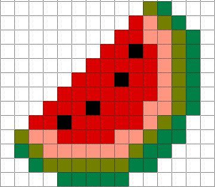

## __C'est quoi un pixel image__   
   #### Un pixel, abréviation de « élément d'image », est la plus petite unité d'une image ou d'un écran numérique 

   

 

## __Comment gérer des images de tailles différentes dans un réseau neuronal convolutif__

<ht>
 

## __*- Contraintes techniques : Uniformer le images*__

* __Les CNN nécessitent des entrées de taille fixe__
* __Les couches fully-connected à la fin du réseau attendent un nombre fixe d'entrées__

 

## __*- Avantages pratiques :*__

* __Permet le traitement par lots (batching)__
* __Optimise les calculs parallèles__
* __Réduit la consommation mémoire__

Source : https://isprs-archives.copernicus.org/articles/XLVI-4-W5-2021/501/2021/

 

### __*- Inconvénients possibles*__
* #### Distorsion du contenu
Si le resizing ignore le ratio d'aspect (rapport largeur/hauteur), les images peuvent être étirées ou compressées, ce qui pourrait supprimer ou déformer des informations structurales importantes, surtout pour des données médicales comme les rayons X.​

Source : https://qastack.fr/datascience/30819/image-resizing-and-padding-for-cnn

* #### Perte d'information
Redimensionner les images vers une taille trop petite risque de perdre des détails essentiels pour la classification. À l'inverse, des tailles trop élevées sont gourmandes en ressources et ralentissent l'entraînement.​

Source : https://www.sciencedirect.com/science/article/pii/S2405844023064617

* #### Variabilité de la résolution
Les CNN sont sensibles à la résolution des images : une image à basse résolution peut mener à une baisse de performance si les caractéristiques importantes sont floues ou perdues.​

Source : https://www.sciencedirect.com/science/article/pii/S2405844023064617

 

### __*- Optimisations pour préserver l'information*__
* #### Respect du ratio d'aspect
Pour conserver la structure originale, il est recommandé d'utiliser du padding (remplissage) après un redimensionnement partiel afin de maintenir le ratio d'aspect.​

Source : https://stackoverflow.com/questions/47697622/cnn-image-resizing-vs-padding-keeping-aspect-ratio-or-not

* #### Choix judicieux de la taille
Il est utile de tester différentes tailles (ex : 128x128, 224x224) pour trouver un équilibre entre précision et rapidité d'entraînement.​

* #### Prétraitements complémentaires
Ajouter de la normalisation (remise des valeurs de pixels entre 0 et 1), et appliquer de l'augmentation de données (flip, rotation, etc.) permet d'améliorer la robustesse et la généralisation du modèle.

Source : https://ichi.pro/fr/exploration-de-l-augmentation-des-donnees-d-image-avec-keras-et-tensorflow-184813206747204

